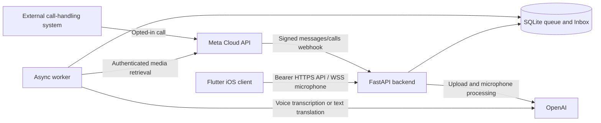
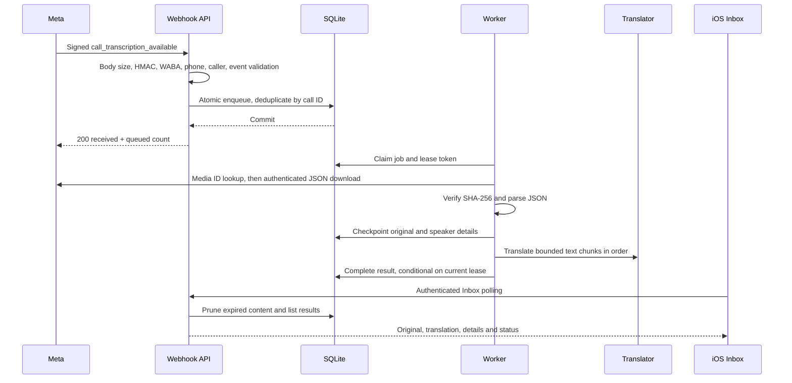
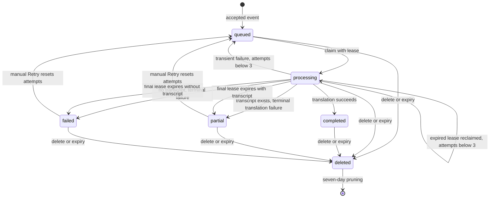

# Architecture and Design — Voice Notes v4

**Revision:** 1.0 · **Baseline:** 4.0.0 · **Date:** September 28, 2026

## 1. System context

The backend trusts neither client-provided tokens nor incoming webhook bodies until the relevant checks pass. Meta secrets authenticate webhook/media operations; the app token protects our API; the OpenAI key authenticates provider work. These are separate credentials.

## 2. Components and responsibilities

| Component | Responsibilities |
| --- | --- |
| `frontend/lib/main.dart` | Upload/live UI, language selection, navigation |
| `frontend/lib/voice_controller.dart` | Connection validation, token memory, HTTP/WebSocket requests and microphone lifecycle |
| `frontend/lib/inbox_page.dart` | Polling, call/voice cards, timeline, copy/retry/delete actions |
| `backend/app.py` | App creation, CORS, HTTP authentication, upload/config/health routes, worker lifecycle |
| `backend/auth.py` | Bearer comparisons and first-frame WebSocket authentication |
| `backend/whatsapp.py` | Webhook verification, audio filters/downloads, routing of queue jobs, worker and Inbox API |
| `backend/call_transcripts.py` | Call-event filtering, authenticated JSON downloads, integrity checks, document parsing, translation chunking |
| `backend/inbox.py` | SQLite schema, transactions, leases, checkpoints, completion and retention |
| `backend/services.py` | File transcription, FFmpeg conversion, text translation, provider error mapping |
| `backend/live.py` | Two upstream sessions for microphone translation and original captions |

## 3. Post-call processing sequence

Unrelated valid events are acknowledged without jobs. Invalid event fields may be ignored by a filter; malformed payload structure can return 400. Download/parse errors after admission appear as failed jobs. A duplicate call with a new media ID is still deduplicated by call identity; automatic replacement/revision of existing transcripts is not implemented.

## 4. Other paths

Voice messages use the same queue but download audio and invoke transcription before translation. OGG/Opus/AAC/AMR conversion uses FFmpeg where required. Manual upload requests run synchronously within the HTTP request and return results directly; they do not create Inbox rows.

Live microphone mode is separate from the queue. After authentication and setup, PCM audio is sent to both a translation session and a companion transcription session. Source and translated text events are relayed to the client. Stop closes/commits the upstream input and allows up to 30 seconds to drain final text. No microphone result is persisted to Inbox by this path.

## 5. Worker and state model

Processing stages are `fetching_transcript`, `parsing_transcript`, and `translating`; they are not separate job statuses. Blank stage is normal outside processing and in some voice-processing steps.

The worker executes one claimed job at a time per backend process. Transactions use `BEGIN IMMEDIATE` for queue admission and claim operations. A new UUID lease token fences writes from older attempts. Checkpoint/completion statements also require a current processing status and an unexpired retention period. Successful original text is checkpointed before any translation call. Translated chunks are not checkpointed individually: a failed translation cycle restarts translation from the saved original.

Transient HTTP exceptions (429 or 5xx), transport/timeouts, and selected Meta HTTP responses (408, 429, 5xx) are eligible for automatic retry. Permanent Meta access/not-found failures require manual correction/retry. Manual retry resets the attempt counter. A process crash is recovered after the lease becomes eligible, not instantly at restart.

## 6. Design decisions and limits

| Decision | Reason | Tradeoff |
| --- | --- | --- |
| Preserve v3 in place; independent v4 defaults | Parallel comparison and recovery | No automatic migration of v3 content |
| Always resolve call media ID afresh | Avoid stale webhook download URLs | An additional Meta request per download attempt |
| Verify hash from signed call event | Detect content mismatch before parsing | Missing/invalid signed digest prevents admission |
| Persist original before translation | Retain useful output and avoid repeated downloads | Results are stored locally until deleted/expired |
| SQLite queue | Minimal local infrastructure and restart persistence | No managed HA, multi-host coordination or measured production scale |
| Single shared app token | Personal prototype scope | No per-user isolation or independent user revocation |
| Foreground polling | Simple iOS/web behavior | No background delivery guarantee or push notification |
| Bounded call chunks | Keep each translation request manageable | Cross-chunk context and linguistic fidelity require evaluation |

## 7. Operational and privacy boundaries

The application stores neither raw webhook bodies nor call JSON files. Call JSON is downloaded into bounded memory; selected fields are persisted. Voice audio uses temporary files removed in normal cleanup, but an abrupt host crash can leave temporary files that require operational review. Credentials remain on the backend; the client uses an app token. Do not use compile-time app-token values for distributed builds even though development UI supports an environment default.

SQLite storage is not application-encrypted. Secure-delete is enabled for SQLite, but this is not evidence of erasure from filesystem snapshots or backups. Content expiry is lazy on access and periodic in the worker, so it is not a hard wall-clock deletion SLA. Review the full lifecycle in [Database](DATABASE.md).

Health only reports process responsiveness and version. It does not test provider readiness, queue age, HTTPS reachability or account permissions. Multiple workers, schema initialization races, provider contract changes and restart behavior under real process failure need further integration/load testing before production use.
